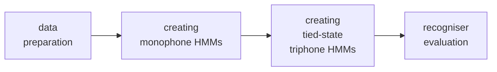

# HTK - tutorial para treino de modelo acústico

For this tutorial we are following the chapter 3 of the HTKBook for HTK version
3.4



### 3.0 FalaBrasil Environment Tree

```
HLEd                                                HTK Label Editor   
  -l '*'                                            dir to store label file (MLF header)   
  -d etc/dictionary.dic                             load phonetic dict   
  -i etc/phones0.mlf (or phones_sp.mlf)             output MLF transcription to file    
  $MYHTKPROJ/util/mkphones.led (or mkphones_sp.led) command editor file    
  $MYHTKPROJ/etc/words.mlf                          label file
```

```
HCopy                                "copy" an in file to an encoded out file
  -T 1                               set trace flag
  -C conf/edaz.conf                  set config file
  $MYHTKPROJ/wav/train/file.wav      input audio file
  $MYHTKPROJ/wav/train/file.mfc      output parameterized audio file
```

3.1.4: Step 4 - Creating the Transcription Files | 3.1.5: Step 5 - Coding the Data
:-----------------------------------------------:|:------------------------------:
 | 

### 3.2 Creating Monophone HMMs (fb\_02\_create\_monoph\_hmm.sh)
#### 3.2.1 Step 6 - Creating Flat Start Monophones
```
HCompV
  -C conf/hcomp.conf
  -f 0.01
  -m
  -S etc/train\_mfc.scp 
  -M model/flat\_start 
   model/flat\_start/proto
```

3.2.1: Step 6 - Creating Flat Start Monophones
:-----------------------------------------------:
 

                      out                     in dir             in                 in
HHEd -w model/flat\_start/hmms.mlf -d model/flat\_start util/concatenade.hed etc/hmmlist.txt

            in                                in                  in                           in                            out dir        in
HERest -I etc/phones0.mlf -t $PRUNING -S etc/train\_mfc.scp -H model/flat\_start/macros -H model/flat\_start/hmmdefs -M model/mono\_0 etc/hmmlist.txt

#### 3.2.2 Step 7 - Fixing the Silence Models

                  in                         in                         out_dir              in           in
HHEd -H /model/mono\_sp\_0/macros -H /model/mono\_sp\_0/hmmdefs -M /model/mono\_sp\_1 /util/sil.hed /etc/hmm\_sp.list

                            in                        in                     in                                   in                            out_dir             in
HERest -t $PRUNING -I /etc/phones\_sp.mlf -S /etc/train\_mfc.scp -H /model/mono\_sp\_$((i-1))/macros -H /model/mono\_sp\_$((i-1))/hmmdefs -M /model/mono\_sp\_${i} /etc/hmm\_sp.list

#### 3.2.3 Step 8 - Realigning the Training Data
                                               in                    out                         in                                in                           in                   in              in
HVite -o SWT -b sil -a -y lab -m -t 250.0 -I /etc/words.mlf -i /etc/aligned.mlf -H /model/mono\_realign\_0/macros -H /model/mono\_realign\_0/hmmdefs -S /etc/train\_mfc.scp /etc/dictionary.dic /etc/hmm\_sp.list

                          in                  in                          in                                     in                                      out_dir                in
HERest -t $PRUNING -I etc/aligned.mlf -S etc/train\_mfc.scp -H model/mono\_realign\_$((i-1))/macros -H model/mono\_realign\_$((i-1))/hmmdefs -M model/mono\_realign\_${i} etc/hmm\_sp.list

### 3.3 Creating Tied-State Triphones

Script: __fb\_03\_create\_triph\_hmm.sh__

                   out                 in               in              in
HLEd -l '\*' -n etc/triphones1 -i etc/wintri.mlf util/mktri.led etc/phones\_sp.mlf

              in                            in                      out_dir            in             in
HHEd -B -H model/mono\_sp/macros -H model/mono\_sp/hmmdefs -M model/cd\_untied\_0 etc/mktri.hed etc/hmm\_sp.list

                           in                       in                   in                                          in                                 in                
HERest -B -I -t $PRUNING etc/wintri.mlf -S etc/train\_mfc.scp -H model/cd\_untied\_$((i-1))/macros -H model/cd\_untied\_$((i-1))/hmmdefs -M model/cd\_untied\_${i} etc/trifone


[](https://ufpafalabrasil.gitlab.io/ "Visite o site do Grupo FalaBrasil") [](https://portal.ufpa.br/ "Visite o site da UFPA")

__Grupo FalaBrasil (2019)__ - https://ufpafalabrasil.gitlab.io/      
__Universidade Federal do Pará (UFPA)__ - https://portal.ufpa.br/     
Cassio Batista - https://cassota.gitlab.io
